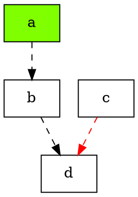
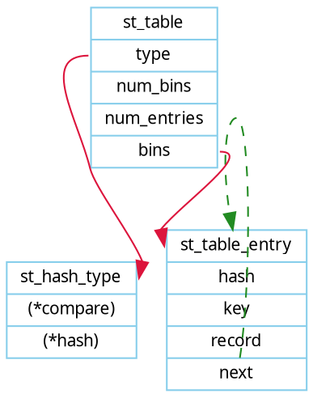
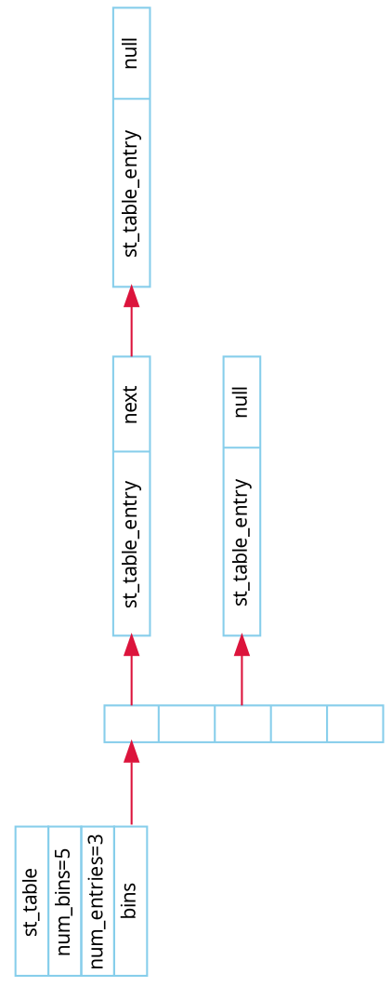
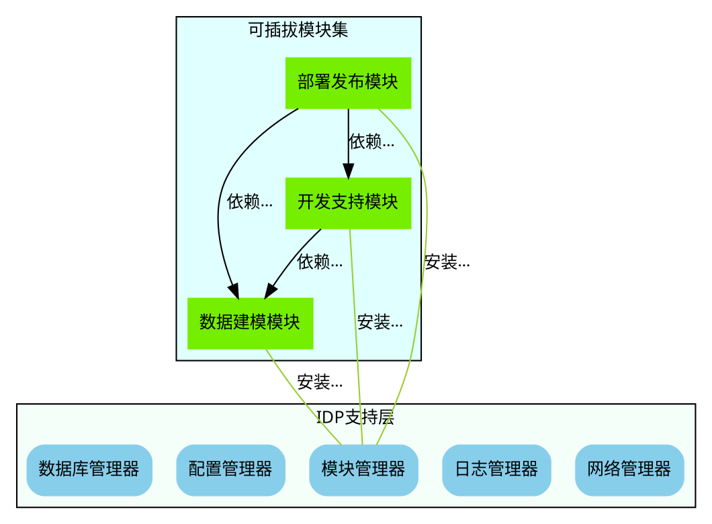
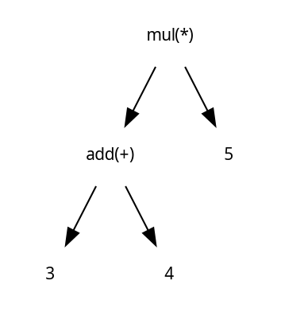
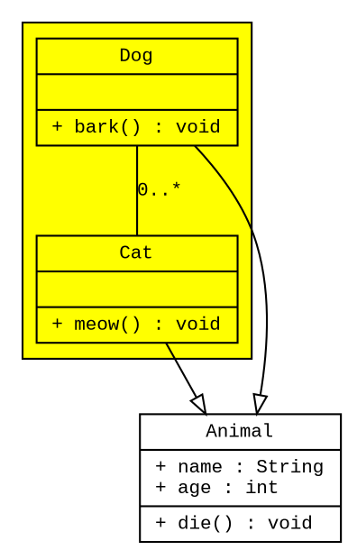
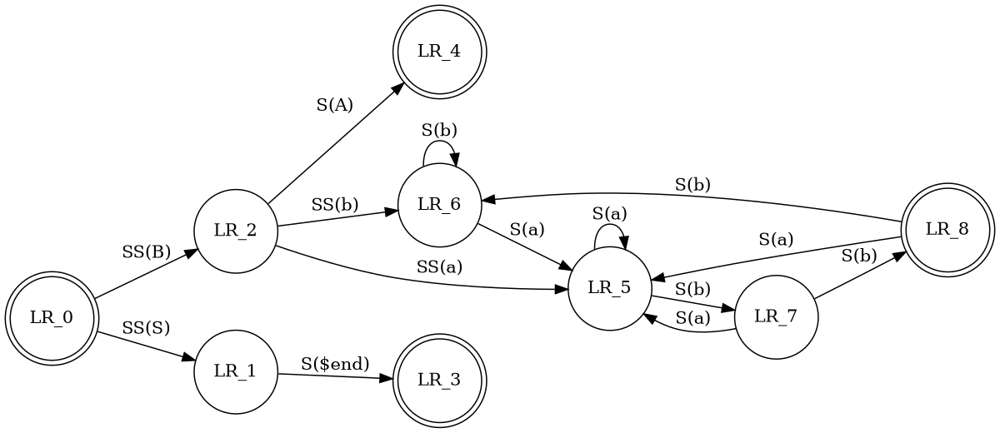
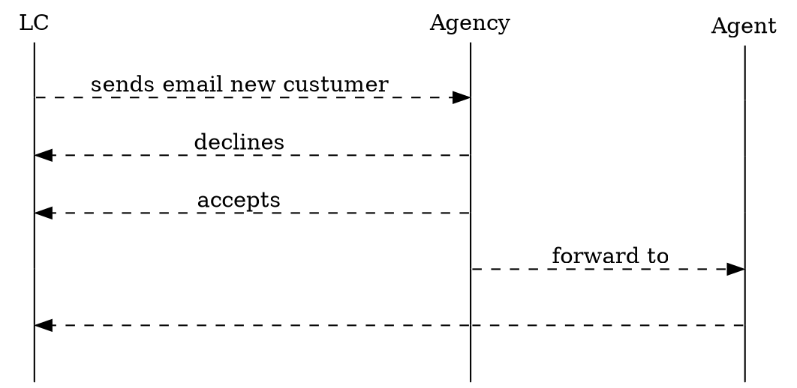

# demo for graphviz

Reference [使用graphviz绘制流程图（2015版）](http://blog.jobbole.com/94472/)

```dot
digraph abc{
  node [shape="record"];
  edge [style="dashed"];
   
  a [style="filled", color="black", fillcolor="chartreuse"];
  b;
  c;
  d;
   
  a -> b;
  b -> d;
  c -> d [color="red"];
}
```

```dot
digraph st2{
  fontname = "Verdana";
  fontsize = 10;
  rankdir=TB;
  
  node [fontname = "Verdana", fontsize = 10, color="skyblue", shape="record"];
  
  edge [fontname = "Verdana", fontsize = 10, color="crimson", style="solid"];
  
  st_hash_type [label="{<head>st_hash_type|(*compare)|(*hash)}"];
  st_table_entry [label="{<head>st_table_entry|hash|key|record|<next>next}"];
  st_table [label="{st_table|<type>type|num_bins|num_entries|<bins>bins}"];
  
  st_table:bins -> st_table_entry:head;
  st_table:type -> st_hash_type:head;
  st_table_entry:next -> st_table_entry:head [style="dashed", color="forestgreen"];
}
```

```dot
digraph st{
  fontname = "Verdana";
  fontsize = 10;
  rankdir = LR;
  rotate = 90;
  
  node [ shape="record", width=.1, height=.1];
  node [fontname = "Verdana", fontsize = 10, color="skyblue", shape="record"];
  
  edge [fontname = "Verdana", fontsize = 10, color="crimson", style="solid"];
  node [shape="plaintext"];
  
  st_table [label=<
      <table border="0" cellborder="1" cellspacing="0" align="left">
      <tr>
      <td>st_table</td>
      </tr>
      <tr>
      <td>num_bins=5</td>
      </tr>
      <tr>
      <td>num_entries=3</td>
      </tr>
      <tr>
      <td port="bins">bins</td>
      </tr>
      </table>
  >];
  
  node [shape="record"];
  num_bins [label=" <b1> | <b2> | <b3> | <b4> | <b5> ", height=2];
  node[ width=2 ];
  
  entry_1 [label="{<e>st_table_entry|<next>next}"];
  entry_2 [label="{<e>st_table_entry|<next>null}"];
  entry_3 [label="{<e>st_table_entry|<next>null}"];
  
  st_table:bins -> num_bins:b1;
  num_bins:b1 -> entry_1:e;
  entry_1:next -> entry_2:e;
  num_bins:b3 -> entry_3:e;
}
```

```dot
digraph idp_modules{
 
  rankdir = TB;
  fontname = "Microsoft YaHei";
  fontsize = 12;
  
  node [ fontname = "Microsoft YaHei", fontsize = 12, shape = "record" ];
  edge [ fontname = "Microsoft YaHei", fontsize = 12 ];
  
      subgraph cluster_sl{
          label="IDP支持层";
          bgcolor="mintcream";
          node [shape="Mrecord", color="skyblue", style="filled"];
          network_mgr [label="网络管理器"];
          log_mgr [label="日志管理器"];
          module_mgr [label="模块管理器"];
          conf_mgr [label="配置管理器"];
          db_mgr [label="数据库管理器"];
      };
  
      subgraph cluster_md{
          label="可插拔模块集";
          bgcolor="lightcyan";
          node [color="chartreuse2", style="filled"];
          mod_dev [label="开发支持模块"];
          mod_dm [label="数据建模模块"];
          mod_dp [label="部署发布模块"];
      };
  
  mod_dp -> mod_dev [label="依赖..."];
  mod_dp -> mod_dm [label="依赖..."];
  mod_dp -> module_mgr [label="安装...", color="yellowgreen", arrowhead="none"];
  mod_dev -> mod_dm [label="依赖..."];
  mod_dev -> module_mgr [label="安装...", color="yellowgreen", arrowhead="none"];
  mod_dm -> module_mgr [label="安装...", color="yellowgreen", arrowhead="none"];
}
```

```dot
digraph ast{
  fontname = "Microsoft YaHei";
  fontsize = 10;
  
  node [shape = circle, fontname = "Microsoft YaHei", fontsize = 10];
  edge [fontname = "Microsoft YaHei", fontsize = 10];
  node [shape="plaintext"];
  
  mul [label="mul(*)"];
  add [label="add(+)"];
  
  add -> 3
  add -> 4;
  mul -> add;
  mul -> 5;
}
```

```dot
digraph G{
  
  fontname = "Courier New"
  fontsize = 10
  
  node [ fontname = "Courier New", fontsize = 10, shape = "record" ];
  edge [ fontname = "Courier New", fontsize = 10 ];
  
  Animal [ label = "{Animal |+ name : String\l+ age : int\l|+ die() : void\l}" ];
  
      subgraph clusterAnimalImpl{
          bgcolor="yellow"
          Dog [ label = "{Dog||+ bark() : void\l}" ];
          Cat [ label = "{Cat||+ meow() : void\l}" ];
      };
  
  edge [ arrowhead = "empty" ];
  
  Dog->Animal;
  Cat->Animal;
  Dog->Cat [arrowhead="none", label="0..*"];
}
```

```dot
digraph finite_state_machine {
  rankdir = LR;
  size = "8,5"
  
  node [shape = doublecircle];
  
  LR_0 LR_3 LR_4 LR_8;
  
  node [shape = circle];
  
  LR_0 -> LR_2 [ label = "SS(B)" ];
  LR_0 -> LR_1 [ label = "SS(S)" ];
  LR_1 -> LR_3 [ label = "S($end)" ];
  LR_2 -> LR_6 [ label = "SS(b)" ];
  LR_2 -> LR_5 [ label = "SS(a)" ];
  LR_2 -> LR_4 [ label = "S(A)" ];
  LR_5 -> LR_7 [ label = "S(b)" ];
  LR_5 -> LR_5 [ label = "S(a)" ];
  LR_6 -> LR_6 [ label = "S(b)" ];
  LR_6 -> LR_5 [ label = "S(a)" ];
  LR_7 -> LR_8 [ label = "S(b)" ];
  LR_7 -> LR_5 [ label = "S(a)" ];
  LR_8 -> LR_6 [ label = "S(b)" ];
  LR_8 -> LR_5 [ label = "S(a)" ];
}
```

```dot
digraph G {
    rankdir="LR";
    node[shape="point", width=0, height=0];
    edge[arrowhead="none", style="dashed"]

    {
        rank="same";
        edge[style="solided"];
        LC[shape="plaintext"];
        LC -> step00 -> step01 -> step02 -> step03 -> step04 -> step05;
    }

    {
        rank="same";
        edge[style="solided"];
        Agency[shape="plaintext"];
        Agency -> step10 -> step11 -> step12 -> step13 -> step14 -> step15;
    }

    {
        rank="same";
        edge[style="solided"];
        Agent[shape="plaintext"];
        Agent -> step20 -> step21 -> step22 -> step23 -> step24 -> step25;
    }

    step00 -> step10 [label="sends email new custumer", arrowhead="normal"];
    step11 -> step01 [label="declines", arrowhead="normal"];
    step12 -> step02 [label="accepts", arrowhead="normal"];
    step13 -> step23 [label="forward to", arrowhead="normal"];
    step24 -> step14;
    step14 -> step04 [arrowhead="normal"];
}
```